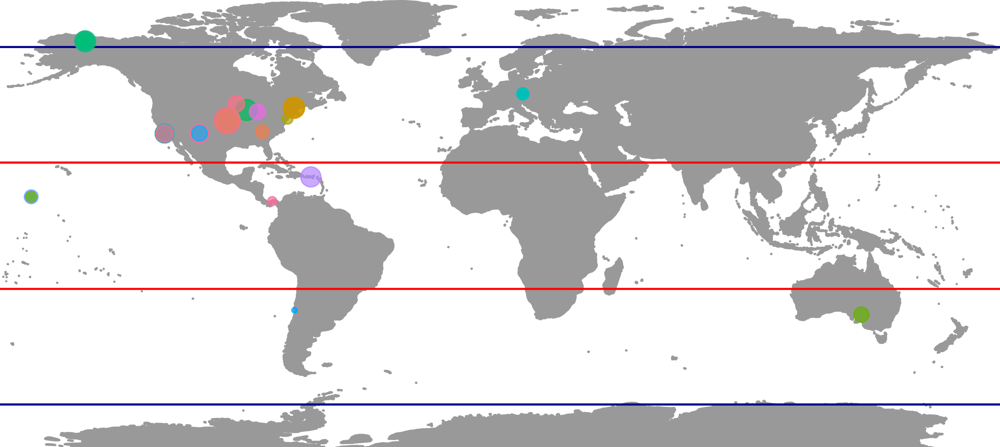
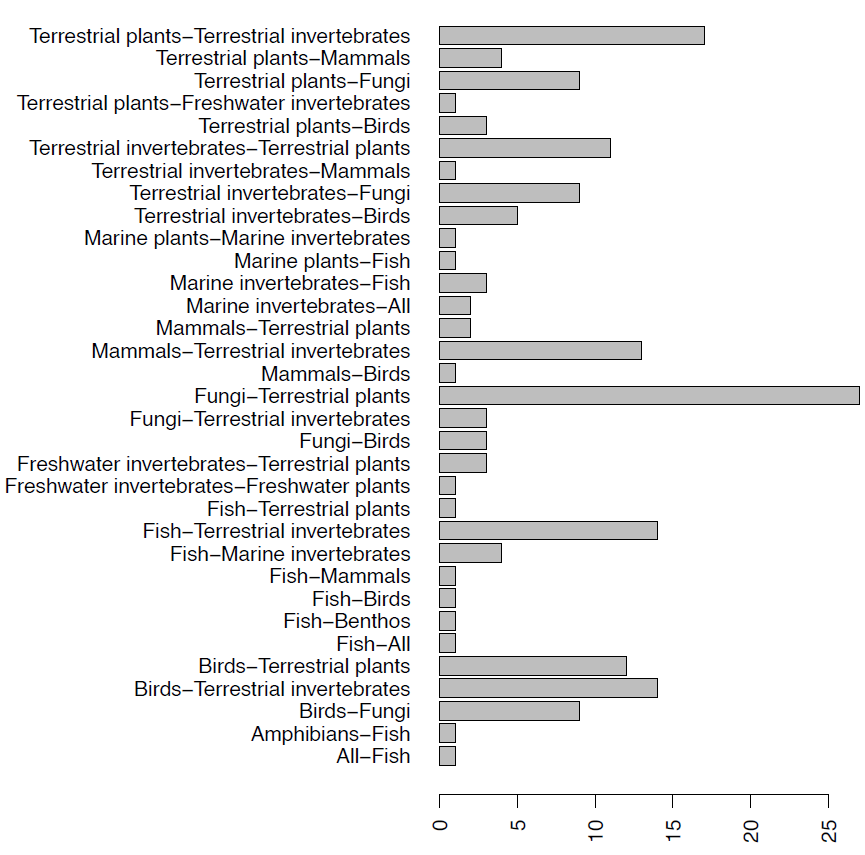

# Pipeline code

This code compiles all scripts used for downloading data, data processing, data analyses.

## 1. Download data and generate starting database

Dataset downloaded on 15 Mar 2023 (NC)

Fill out download request: <https://biotime.st-andrews.ac.uk/downloadFull.php>

[[ TO DO - brief description of raw data ]]

-   RE-RUN ANALYSES

```{r}
# source('scripts/prep_biotime/create_pairs.R')
```

To establish meaningful response-predictor pairs for analyses, we **subset BioTIME to geographic study locations within 10 km of each other**. This restricted the data to primarily within North America (Figure 1 & 2).

-   367 study pairs are within 10 km of each other.

[[ TO DO - describe methodology more in detail ]]

-   LOAD RESULTS

Full dataset with species/abundance:

```{r}
load("data/tidy/collated_pairs.RData")

head(collated.pairs)
```

Biotime metadata for 10 km pairs to use:

```{r}
load("data/prep_biotime/meta_pairs_10km.RData")

head(meta.pairs)
```

"key" with overlapping studies, and reference:

```{r}

load("data/prep_biotime/bio_pairs_10km.RData")

head(bio.pairs)
```

{width="100%" height="70%"}

{width="100%" height="70%"}

## 2. Data processing

RE-RUN ANALYSES (estimated time: 30min):

```{r}
#source('scripts/data_processing/Functions_data.processing.R')
#source('scripts/data_processing/Data.processing.R') 

```

To retain only pairs with enough information for a predictive relationship, we kept species with at least 3 total observations (across years or site).

-   **Genera pairs**

[[ TO DO ]]

-   **Standarization of sampling effort**

We standardized sampling effort within study by dividing the abundance or biomass of each species in each study per year by the number of plots in that study per year. This allowed us to account for species with low sampling counts and account for studies that had more than one site visit per year and/or multiple plots per site. For studies without plot locations we assumed each study was one large plot (ie standardizing by 1).

-   **Genera pairs with 10 consecutive years overlapping time series**

Since we only wanted to compare genera with overlapping time series, we calculated the number of consecutive years with overlapping abundance data for each unique genera-genera pairing, only retaining pairs with at least 10 years of consecutive overlap.

To compare changes in abundance between overlapping years for these genera-genera pairs, we use log-transformed growth rates, a common approach for dealing with time series and temporally autocorrelated data that removes temporal autocorrelation as yearly change is not dependent on the absolute value of abundance in the prior year.

(We also calculated mean, median, minimum, maximum, and the coefficient of variation using the standardized species abundances.)

-   **Assign interaction types between pairs**

[[ TO DO ]]

-   Load results:

The previous processing steps yields the following table:

```{r}
log_change_interaction <- readRDS("data/preprocessing/log.prop.change.interactions.RDS")

head(log_change_interaction)
```

We can visualize some data:

-   variation in sampling effort across years within each study:

```{r}
library(ggpubr)
ggarrange(plot, plot2, nrow = 2, ncol = 1, legend = FALSE)
```

## 3. Data analyses

### 3.1. Q1 - Does yearly abundance change in one genus predict yearly abundance change in another genus?

-   RE-RUN ANALYSES

```{r}
source('scripts/analyses_Q1/prelim_LMM.R')
```

-   Load results:

```{r}

```

### 3.2. Q2 - What other biotic (e.g., trophic interactions) and abiotic (e.g., treatment, climate) modify the prediction accuracy from Q1?

-   RE-RUN ANALYSES

```{r}
source('scripts/analyses_Q1/explore_Q2.R')
```

-   Load results:

```{r}

```
